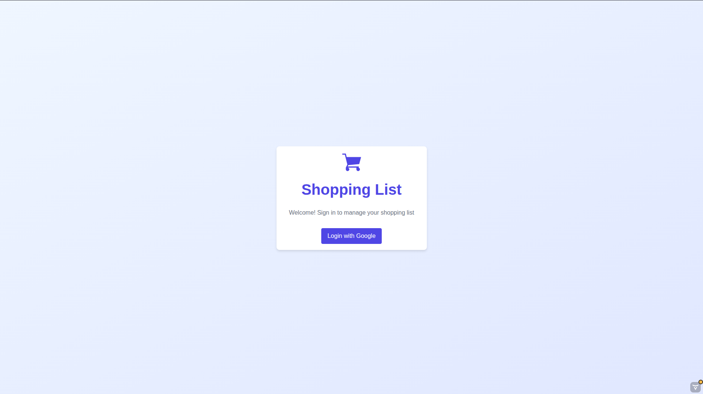
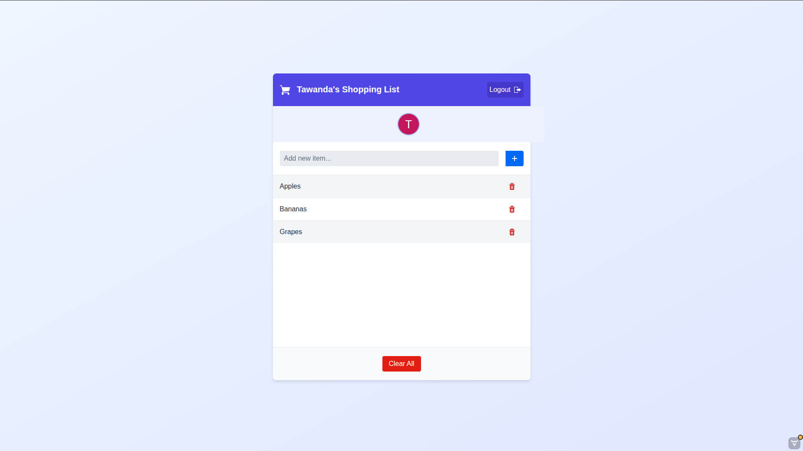
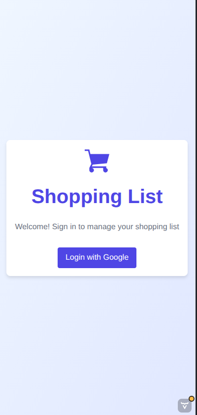
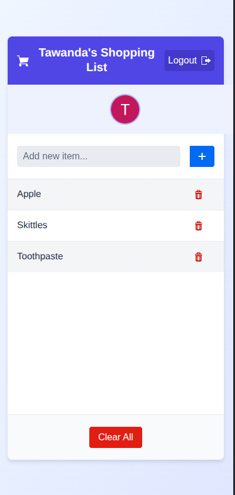

# Shopping List Web App 🛒

A modern and user-friendly shopping list web application built with Spring Boot for the backend and Vaadin for the
frontend UI, featuring Google OAuth 2.0 authentication.

## Overview

This application provides a digital platform for creating, viewing, and managing personal shopping lists. The app
features a clean, intuitive interface designed with Vaadin, a Java web framework for building modern web apps.

## Features ✨

- **Google OAuth 2.0 Authentication** for secure user login
- **Persistent shopping lists** that save between user sessions
- **Add items** to your shopping list with a simple interface
- **View your entire shopping list** with a clean, organized layout
- **Delete individual items** from your list as needed
- **Clear entire list** with a single button click
- **Responsive UI** that works on mobile and desktop
- **User profile integration** showing your Google profile picture

## Screenshots

<table>
  <!-- Row 1 -->
  <tr>
    <td style="text-align:center">
      
      <p><em>Login Screen with Google Authentication</em></p>
    </td>
  </tr>

<!-- Row 2 -->
  <tr>
    <td style="text-align:center">
      
      <p><em>Login Screen Mobile View</em></p>
    </td>

  </tr>
</table>

<table>

<!-- Row 2 -->
  <tr>
    <td style="text-align:center">
      
      <p><em>Login Screen Mobile View</em></p>
    </td>
    <td style="text-align:center">
      
      <p><em>Main Shopping List Mobile View</em></p>
    </td>
  </tr>
</table>

## Tech Stack 🛠️

### Backend:

- Java 21
- Spring Boot 3.x
- Spring Security with OAuth 2.0
- JPA/Hibernate
- Database: H2 (development) / PostgreSQL (production)
- Maven for dependency management

### Frontend:

- Vaadin Flow Framework

## Getting Started

### Prerequisites ⚙️

1. JDK 21 or newer
2. Maven 3.6 or newer
3. Google Developer Account (for OAuth 2.0 credentials)
4. PostgreSQL (optional, for production)

### Installation

1. Clone the repository:
    ```bash
    git clone https://github.com/yourusername/shopping-list-webapp.git
    ```

2. Navigate to the project directory:
    ```bash
    cd shopping-list-webapp
    ```

3. Set up Google OAuth 2.0 credentials:
    - Go to the [Google Developer Console](https://console.developers.google.com/)
    - Create a new project or select an existing one
    - Go to "Credentials" > "Create Credentials" > "OAuth client ID"
    - Choose "Web application" as the application type
    - Add your authorized redirect URIs (e.g., `http://localhost:8080/login/oauth2/code/google`)
    - Note your Client ID and Client Secret

4. Configure OAuth credentials in your application:
    - Open `src/main/resources/application.properties`
    - Add the following properties with your Google OAuth credentials:
      ```properties
      spring.security.oauth2.client.registration.google.client-id=YOUR_CLIENT_ID
      spring.security.oauth2.client.registration.google.client-secret=YOUR_CLIENT_SECRET
      ```

5. Database Configuration:
    - For H2 (default development database):
      ```properties
      # H2 Database Configuration
      spring.datasource.url=jdbc:h2:mem:shoppinglistdb
      spring.datasource.driverClassName=org.h2.Driver
      spring.datasource.username=sa
      spring.datasource.password=password
      spring.jpa.database-platform=org.hibernate.dialect.H2Dialect
      spring.h2.console.enabled=true
      spring.h2.console.path=/h2-console
      ```

    - For PostgreSQL (production):
      ```properties
      # PostgreSQL Configuration
      spring.datasource.url=jdbc:postgresql://localhost:5432/shoppinglistdb
      spring.datasource.username=postgres
      spring.datasource.password=your_password
      spring.jpa.properties.hibernate.dialect=org.hibernate.dialect.PostgreSQLDialect
      spring.jpa.hibernate.ddl-auto=update
      ```

6. Build the application:
    ```bash
    mvn clean install
    ```

7. Run the application:
    ```bash
    mvn spring-boot:run
    ```

8. Access the application in your web browser at `http://localhost:8080`

## Usage

1. **Login**: Click the "Login with Google" button on the landing page to authenticate with your Google account.
2. **Add Items**: Type the name of the item you want to add in the text field and click the "+" button.
3. **View Items**: Your shopping list will display all items you've added, with the most recent at the top.
4. **Delete Items**: Click the trash icon next to any item to remove it from your list.
5. **Clear All**: Click the "Clear All" button at the bottom to remove all items from your list at once.
6. **Logout**: Click the "Logout" button in the header to sign out of your account.

## Project Structure

```
shopping-list-webapp/
├── src/
│   ├── main/
│   │   ├── java/
│   │   │   └── uk/project/shoppinglistwebapp/
│   │   │       ├── model/
│   │   │       │   ├── ShoppingItem.java
│   │   │       │   └── User.java
│   │   │       ├── repository/
│   │   │       │   ├── UserRepository.java
│   │   │       │   └── ShoppingItemRepository.java
│   │   │       ├── security/
│   │   │       │   └── SecurityConfig.java
│   │   │       ├── service/
│   │   │       │   ├── ShoppingListService.java
│   │   │       │   └── ShoppingListServiceImpl.java
│   │   │       └── ui/
│   │   │           ├── LoginView.java
│   │   │           └── MainView.java
│   │   └── resources/
│   │       ├── application.properties
│   │       └── static/
│   └── test/
│       └── java/
│           └── uk/project/shoppinglistwebapp/
│               └── service/
│                   └── ShoppingListServiceTest.java
└── pom.xml
```

## Security

The application uses Spring Security with OAuth 2.0 for authentication. User sessions are managed securely, and CSRF
protection is enabled to prevent cross-site request forgery attacks.

## Database

The application supports two database options:

- **H2 (Development)**: An in-memory database that is perfect for development and testing. The H2 console is accessible
  at `/h2-console` when `spring.h2.console.enabled=true`.

- **PostgreSQL (Production)**: A robust, production-ready database. Make sure to create a database named '
  shoppinglistdb' before running the application with PostgreSQL.

## Future Improvements

- Multiple Lists per User.
- List categories.
- Sharing lists to other users.

## Acknowledgments

- [Spring Boot](https://spring.io/projects/spring-boot) for the backend framework
- [Vaadin](https://vaadin.com/) for the frontend UI framework
- [Google OAuth 2.0](https://developers.google.com/identity/protocols/oauth2) for authentication